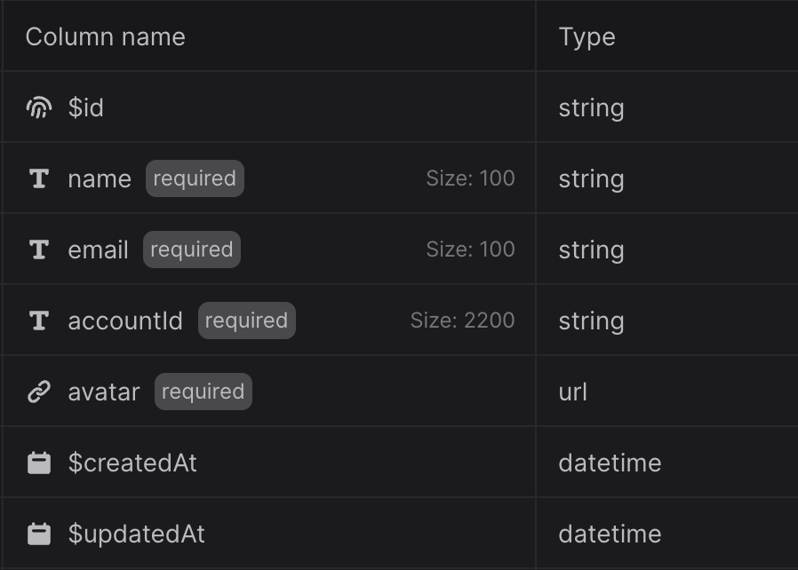
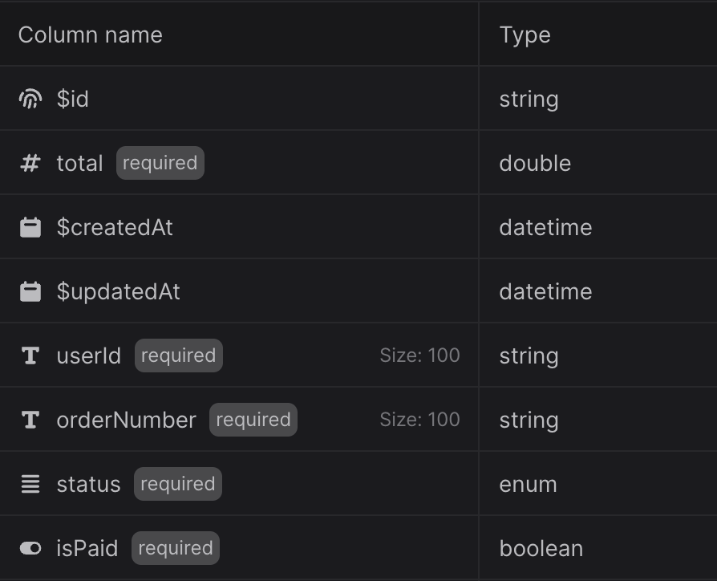
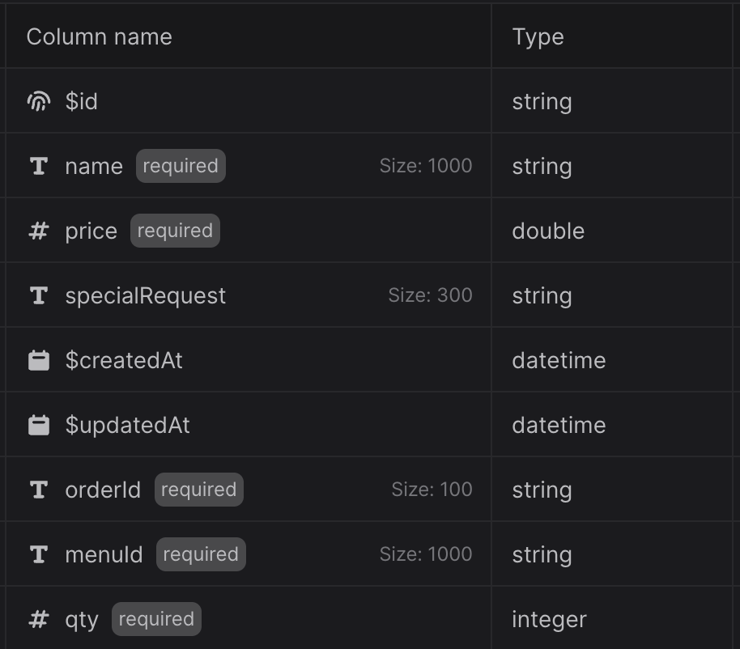

# user

# orders

- has its own new unique $id
- orders.userId -> refers to user.$id

# orders_items

- has its own new unique $id
- orders_items.orderId -> refers to orders.$id

# promo_codes
- codeUpper (string, store uppercase, unique)
- isActive (boolean)
- type (enum: "PERCENT" or "FIXED")
- value (number) depends on type
  - percent: e.g. 10 means 10%
  - fixed: store cents (e.g. 300 = $3.00)
- maxDiscountCents (integer, optional, useful for percent promos)
- minSubtotalCents -> to allow for the discount to be used
- usageLimitPerUser -> set to 1

# promo_redemptions
- promoId -> refers to promo_codes.$id
- userId -> refers to user.$id
- redeemedAt (datetime)
- discountCents (int) (optional)

## to check whether redeeemed before:
existing = query promo_redemptions
  where promoId = X
  and userId = Y

if (existing.length > 0) {
  reject
}
